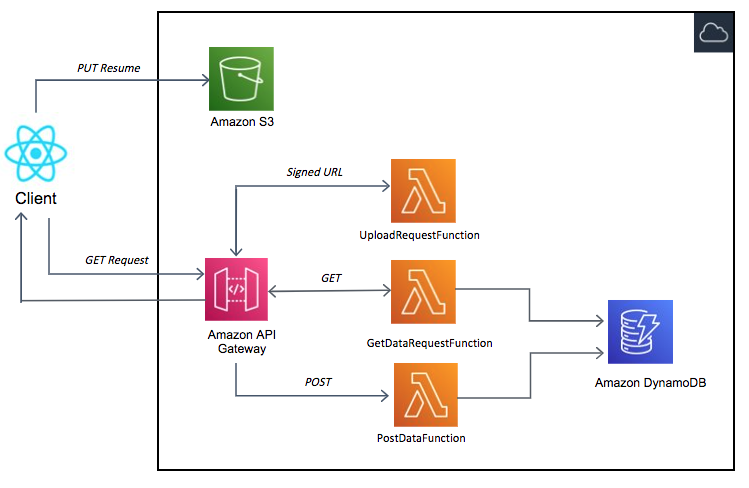

# resume_uploader_main



```bash
.
├── README.MD                   <-- This instructions file
├── frontend                    <-- React application illustrating upload pdf files
├── getSignedURL                <-- Source code for the serverless backend
├── template.yaml               <-- SAM template for deploying serverless resourses
```

## Requirements

- AWS CLI already configured with Administrator permission
- [AWS SAM CLI installed](https://docs.aws.amazon.com/serverless-application-model/latest/developerguide/serverless-sam-cli-install.html) - minimum version 0.48.
- [NodeJS 12.x installed](https://nodejs.org/en/download/)
- [React installed](https://www.youtube.com/watch?v=00kXjx9k3Os)

## Installation Instructions

1. [Create an AWS account](https://portal.aws.amazon.com/gp/aws/developer/registration/index.html) if you do not already have one and login.

2. Clone the repo with submodule onto your local development machine using `git clone --recursive <url>`.

### Installing the application

1. First let's build backend resourses using AWS SAM

```
cd resume_uploader_main
sam deploy --guided
```

When prompted for parameters, enter:

- Stack Name: s3Uploader
- AWS Region: your preferred AWS Region (e.g. us-east-2)
- Confirm changes before deploy [y/N]: y
- UploadRequestFunction may not have authorization defined, Is this okay? [y/N]: y
- Accept all other defaults.

This will create cloudformation stack and takes several minutes to deploy resources. At the end of the deployment, note the output values, as you need these later.

- The APIendpoint value is important - it looks like https://ab123345677.execute-api.us-west-2.amazonaws.com.
- **The upload URL is your endpoint** with the /uploads route added - for example: https://ab123345677.execute-api.us-west-2.amazonaws.com/uploads.

### Testing with the frontend application

The frontend code is saved in the `frontend` subdirectory.

1. Before running, you need to set the API Gateway endpoint from the backend deployment on line 10 in the `App.js` file.

2. In `frontend` directory run `npm install`. After dependencies are installed run `npm start` to launch application on `http://localhost:3000`

3. Use [this tutorial](https://www.youtube.com/watch?v=DHLZAzdT44Y) to [deploy using AWS Amplify Console](https://aws.amazon.com/amplify/console/).

4. Once the page is loaded from a remote location, upload a PDF file in the front-end and you will see the object in the backend S3 bucket.
