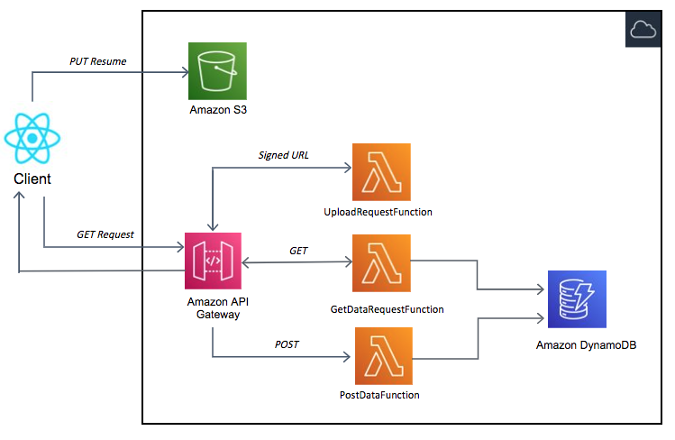

# resume_uploader_main



```bash
.
├── README.MD                   <-- This instructions file
├── frontend                    <-- React application illustrating upload pdf files
├── getSignedURL                <-- Source code for the serverless backend
├── template.yaml               <-- SAM template for deploying serverless resourses
```
## Requirements

* AWS CLI already configured with Administrator permission
* [AWS SAM CLI installed](https://docs.aws.amazon.com/serverless-application-model/latest/developerguide/serverless-sam-cli-install.html) - minimum version 0.48.
* [NodeJS 12.x installed](https://nodejs.org/en/download/)
* [React installed](https://www.youtube.com/watch?v=00kXjx9k3Os)


## Installation Instructions

1. [Create an AWS account](https://portal.aws.amazon.com/gp/aws/developer/registration/index.html) if you do not already have one and login.

2. Clone the repo onto your local development machine using `git clone`.

### Installing the application

:

```
cd .. 
sam deploy --guided
```

When prompted for parameters, enter:
- Stack Name: s3Uploader
- AWS Region: your preferred AWS Region (e.g. us-east-1)
- Accept all other defaults.

This takes several minutes to deploy. At the end of the deployment, note the output values, as you need these later.

- The APIendpoint value is important - it looks like https://ab123345677.execute-api.us-west-2.amazonaws.com.
- **The upload URL is your endpoint** with the /uploads route added - for example: https://ab123345677.execute-api.us-west-2.amazonaws.com/uploads.

